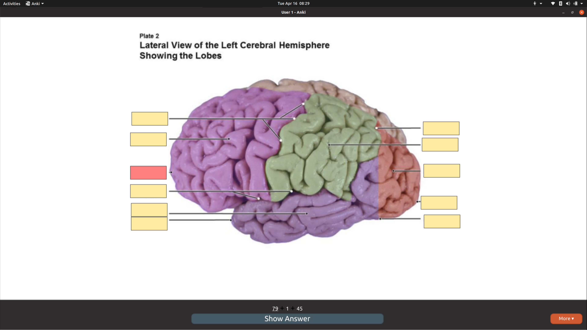

# My Anki Addons
Addons I have made for anki

## Clean UI

- removes some of the extra bars in reviewer mode.
  

## Progress Bar

The progress bar is a fork of glutanimate's progress bar. It shows progress towards goal of number of cards seen in a day.

## Instalation

### AnkiWeb

Visit [ankiweb](https://ankiweb.net/shared/info/1590626921) to download the latest release of **Clean UI**

### Compile

Download the folder containing the desired plugin and put it in your anki addons folder as described [here](https://apps.ankiweb.net/docs/manual.html)

## Acknowledgments

Big thanks to @glutanimate for the starting code behind **Progress Bar**